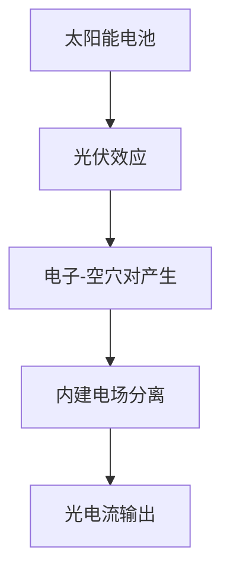
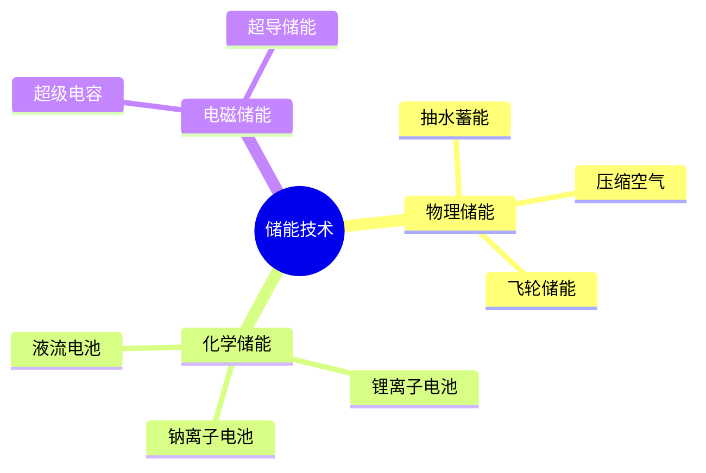
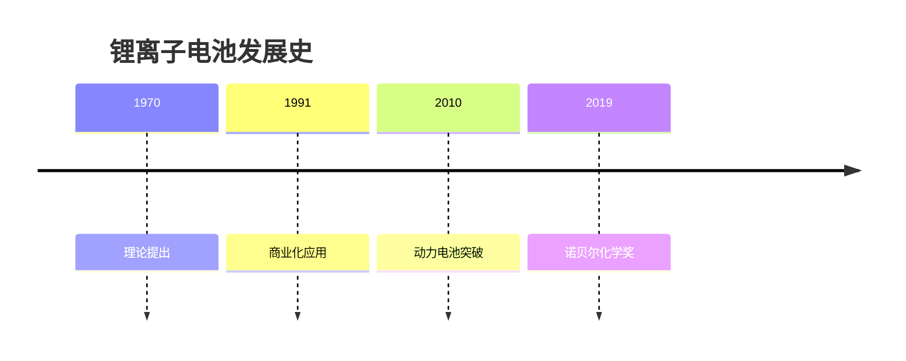
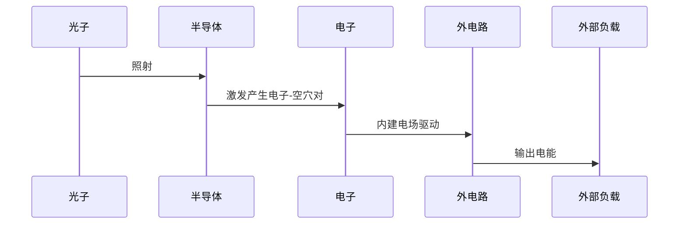
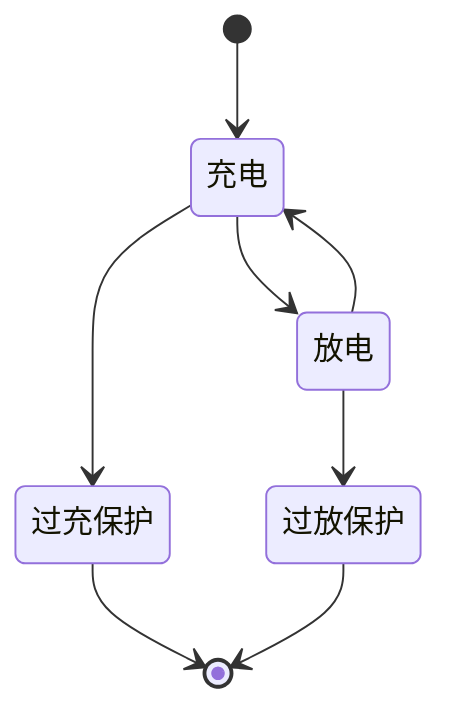

# 数字教材可视化方案规划

## 核心洞察

### 价值定位
**数字教材的价值捕获在于可视化**，而非 AI 生成内容。

### 设计理念参考：Napkin.ai

**Napkin.ai 的核心价值**：
> "Napkin 可以将你的文字转化为图像，让你能够快速有效地可视化内容"

**对我们的启示**：
- ✅ **文字 → 视觉**：将抽象的教材文字转化为直观的图形
- ✅ **快速理解**：学生能在 5-10 秒内抓住核心概念
- ✅ **增强记忆**：视觉化内容比纯文字更容易记忆
- ✅ **降低门槛**：复杂的理工科概念通过图形变得易懂

**我们的差异化**：
- Napkin.ai 是 AI 生成，我们是**人工策展**
- Napkin.ai 通用场景，我们专注**理工科教材**
- Napkin.ai 在线工具，我们**嵌入教材阅读流程**

---

## 关键原则

1. **可控性优先**：硬核理工科内容（物理公式、化学方程式）AI 容易出错，采用预制内容最可控
2. **人工策展**：精选核心知识点，专家设计高质量可视化
3. **场景融合**：书籍阅读页为主 + 音频时间轴同步为辅
4. **交互自然**：点击按钮弹出可视化，不打断阅读流程

---

## 技术选型：Mermaid.js

### 为什么选择 Mermaid？
- ✅ 项目已集成（`mermaid@^11.12.1`）
- ✅ 纯文本语法，易于版本管理
- ✅ 支持 10+ 种图表类型
- ✅ 客户端渲染，性能好
- ✅ 无需额外设计工具

---

## 理工科教材适用的可视化类型

**核心原则**：选择能**解释原理、展示流程、呈现结构**的图表类型。

#### 1. 流程图 (Flowchart) ⭐⭐⭐⭐⭐
**最适合：工作原理、流程步骤、概念关系**


#### 2. 思维导图 (Mind Map) ⭐⭐⭐⭐⭐
**最适合：分类体系、知识架构**


#### 3. 时间线 (Timeline) ⭐⭐⭐⭐⭐
**最适合：历史发展、里程碑事件**


#### 4. 序列图 (Sequence Diagram) ⭐⭐⭐⭐
**最适合：能量转换过程、交互机制**


#### 5. 状态图 (State Diagram) ⭐⭐⭐⭐
**最适合：系统状态、运行模式**


---

## ⚠️ 理工科教材不适用的类型

### 饼图 (Pie Chart) ❌
**为什么不适合**：
- 理工科重视**原理和过程**，饼图只能展示比例
- 学生需要理解"为什么"，而不是"占比多少"
- 比例数据用表格或柱状图更清晰
- 例外：极少数市场分析场景可使用

### 甘特图 (Gantt Chart) ❌
**为什么不适合**：
- 适合项目管理，不适合知识讲解
- 学生关注技术原理，而非开发时间线
- 时间线图（Timeline）更适合展示技术发展历程

### 类图/ER图 ❌
**为什么不适合**：
- 适合软件工程，物理/化学教材用不上
- 理工科更需要物理模型和能量流动图

---

## 书籍页面交互设计

### 主要展示场景
**书籍阅读页（`/book` 或章节阅读页）为核心场景**

### 交互方式

#### 方案 A：浮动可视化按钮 ⭐推荐
**用户体验**：
1. 学生阅读教材内容
2. 在关键段落旁边显示一个**浮动的可视化图标按钮**
3. 鼠标悬停显示提示："查看流程图：光伏效应原理"
4. 点击按钮，弹出 Modal/Dialog 展示可视化
5. 可视化支持缩放、拖拽，全屏查看
6. 关闭后继续阅读，不打断流程

**技术实现**：
```tsx
// 在段落旁边显示按钮
<div className="relative">
  <p>{paragraphContent}</p>
  {hasVisualization && (
    <button
      className="absolute -right-12 top-0 w-10 h-10 bg-brand-primary rounded-full"
      onClick={() => openVisualizationModal(visualizationId)}
    >
      <Sparkles className="w-5 h-5 text-white" />
    </button>
  )}
</div>

// 弹出Modal显示可视化
<Dialog open={isOpen} onOpenChange={setIsOpen}>
  <DialogContent className="max-w-5xl">
    <MermaidViewer content={visualization.mermaidCode} />
  </DialogContent>
</Dialog>
```

#### 方案 B：内联展开/收起
**用户体验**：
1. 段落后有一个"展开可视化"按钮
2. 点击后在页面内展开显示
3. 再次点击收起

**优点**：不离开页面，适合快速查看
**缺点**：大图可能影响阅读流程

#### 方案 C：侧边栏可视化面板
**用户体验**：
1. 右侧固定侧边栏，显示当前章节所有可视化
2. 点击切换不同的可视化
3. 可以与阅读内容同步滚动

**优点**：一目了然，方便切换
**缺点**：占用屏幕空间，移动端不适用

---

### 不同可视化类型的弹出 UI 设计

#### 流程图 (Flowchart)
- **尺寸**：宽屏 Modal（max-w-5xl）
- **功能**：支持缩放、拖拽
- **交互**：点击节点高亮相关路径
- **导出**：支持下载为 PNG

#### 思维导图 (Mind Map)
- **尺寸**：全屏 Modal（max-w-6xl 或 fullscreen）
- **功能**：可折叠分支、缩放、拖拽
- **交互**：点击节点展开/收起子节点
- **布局**：使用 Markmap 渲染，支持动态布局

#### 时间线 (Timeline)
- **尺寸**：中等 Modal（max-w-4xl）
- **功能**：水平滚动、点击事件查看详情
- **交互**：hover 显示更多信息
- **样式**：纵向或横向布局可选

#### 序列图 (Sequence Diagram)
- **尺寸**：宽屏 Modal（max-w-5xl）
- **功能**：逐步播放、暂停、重播
- **交互**：点击消息线查看详情
- **动画**：可选动画模式，模拟真实过程

#### 状态图 (State Diagram)
- **尺寸**：中等 Modal（max-w-4xl）
- **功能**：高亮状态转换路径
- **交互**：点击状态查看说明
- **模拟**：可选交互模式，模拟状态变化

---

## 实施策略

### 阶段 1：Demo 演示（当前）⭐⭐⭐⭐⭐

**目标**：展示可视化的核心价值，获得客户认可

**当前已实现**：
- ✅ 导读页：思维导图可视化（按章节切换）
- ✅ 音频页：音频讲解 + Mermaid 流程图实时同步
- ✅ AI 助手页：教材问答（Mock 数据）
- ✅ 规划文档：完整的产品方案和技术路线

**下一步实施（根据客户反馈）**：
1. **书籍阅读页**：
   - 创建书籍章节阅读页面（使用 ContentReader 组件）
   - 在关键段落添加**浮动可视化按钮**
   - 点击按钮弹出 Modal 展示可视化
   - 支持 4-5 种核心图表类型（流程图、思维导图、时间线、序列图）

2. **可视化内容策展**：
   - 精选 10-15 个核心知识点
   - 针对理工科教材特点设计可视化
   - 每个可视化配备标题、描述、适用场景

3. **交互优化**：
   - 不同类型图表使用不同的 Modal 尺寸
   - 支持缩放、拖拽、全屏查看
   - 部分类型支持动画演示（序列图）

**技术架构（待实施）**：
```
/lib/visualization-data.ts          → 预制的可视化内容
/components/visualization-modal.tsx → 弹出式可视化组件
/app/book/[chapter]/page.tsx       → 书籍章节阅读页
/docs/visualization-plan.md         → 产品规划文档（已完成）
```

**不做什么**：
- ❌ 不接入数据库（保持 Demo 简洁）
- ❌ 不做后台管理界面
- ❌ 不做 AI 生成功能
- ❌ 不追求全书覆盖（只做核心知识点）

---

### 阶段 2：内容管理系统（产品化前期）⭐⭐⭐⭐

**目标**：建立可扩展的内容生产流程

**做什么**：
1. **数据库设计**：
   - 可视化内容表（支持版本控制）
   - 绑定关系表（书籍位置 / 音频时间点）
   - 审核流程管理
2. **后台管理**：
   - 可视化内容 CRUD
   - Mermaid 代码编辑器 + 实时预览
   - 绑定位置配置
3. **质量控制**：
   - 草稿 → 审核 → 发布流程
   - 专家审核机制

**数据库表结构**（参考设计）：
```sql
-- 可视化内容表
create table visualizations (
  id uuid primary key,
  title text not null,
  chart_type text not null,
  mermaid_code text not null,

  -- 书籍绑定
  chapter_id text not null,
  section_id text,
  paragraph_index int,

  -- 音频绑定
  audio_timestamp int,
  audio_duration int,

  -- 元数据
  curator text,
  review_status text, -- draft, reviewed, published
  tags text[],
  view_count int default 0,

  created_at timestamptz,
  updated_at timestamptz
);
```

---

### 阶段 3：AI 辅助策展（长期规划）⭐⭐⭐

**目标**：提升内容生产效率，但保持质量控制

**做什么**：
1. **AI 识别**：扫描章节内容，推荐适合可视化的段落
2. **AI 生成草稿**：生成 Mermaid 代码，但必须人工审核
3. **质量门槛**：
   - AI 生成 → 专家审核 → 测试验证 → 发布
   - 物理公式、化学方程式必须人工校对

**关键原则**：
- ⚠️ 绝不允许 AI 直接生成内容上线
- ⚠️ 不追求 100% 覆盖，宁缺毋滥
- ⚠️ 硬核理工科内容以人工策展为主

**AI Prompt 示例**：
```
分析以下教材章节内容，判断哪些部分适合用 Mermaid 图表可视化：

【章节内容】
{chapterContent}

【任务】
1. 识别适合可视化的段落（限制：最多推荐 3 个）
2. 为每个段落推荐最合适的 Mermaid 图表类型
3. 生成对应的 Mermaid 语法代码

【可选图表类型】
- flowchart: 流程图（工作原理、步骤）
- mindmap: 思维导图（分类体系、知识架构）
- timeline: 时间线（历史发展）
- sequenceDiagram: 序列图（能量转换、交互过程）
- stateDiagram: 状态图（系统状态）
- pie: 饼图（比例关系）

【输出格式】
JSON 数组，每个元素包含：
{
  "paragraph": "原文段落摘要",
  "reason": "推荐理由",
  "chartType": "图表类型",
  "mermaidCode": "生成的 Mermaid 代码"
}
```

---

## 双重应用场景

### 场景 A：书籍原文嵌入（优先级高）

**用户体验**：
1. 学生阅读章节内容
2. 在关键知识点后自动展示可视化卡片
3. 点击卡片可放大查看
4. 可视化帮助理解复杂概念

**技术实现**：
```typescript
// 数据结构
interface Visualization {
  id: string;
  title: string;
  type: 'flowchart' | 'mindmap' | 'timeline' | 'sequence' | 'state';
  mermaidCode: string;
  chapterId: string;
  paragraphIndex: number; // 嵌入到第几段后
}

// 渲染逻辑
function ContentReader({ chapterId }) {
  const paragraphs = getChapterContent(chapterId);
  const visualizations = getVisualizations(chapterId);

  return paragraphs.map((para, idx) => (
    <>
      <p>{para}</p>
      {visualizations
        .filter(v => v.paragraphIndex === idx)
        .map(v => <VisualizationCard data={v} />)
      }
    </>
  ));
}
```

---

### 场景 B：音频时间轴同步（已实现基础）

**用户体验**：
1. 学生播放音频讲解
2. 音频进度到达特定时间点
3. 自动切换显示对应的可视化图表
4. 图表配合音频讲解，增强理解

**技术实现**：
- 当前 `/audio` 页面已实现基础功能
- 继续扩展支持更多图表类型

---

## 内容策展指南

### 选择标准
1. **核心知识点**：考试重点、难点、易混淆点
2. **适合可视化**：有明确的流程、结构、关系
3. **通用性**：多个章节都会涉及的基础概念

### 优先级（《新能源材料与装备》）

#### P0（必须有）
- 能源分类体系（思维导图）
- 光伏效应原理（流程图）
- 锂电池充放电过程（序列图）
- 燃料电池工作原理（流程图）
- 储能技术对比（饼图/表格）

#### P1（建议有）
- 新能源发展历程（时间线）
- 电池状态转换（状态图）
- 太阳能电池结构（层次图）
- 风力发电系统（架构图）

#### P2（可选）
- 项目实施路线图（甘特图）
- 技术成熟度对比
- 成本效益分析

---

## 成功指标

### Demo 阶段
- ✅ 展示 5+ 种图表类型
- ✅ 覆盖 3-5 个重点章节
- ✅ 书籍嵌入 + 音频同步都能演示
- ✅ 客户认可可视化的价值

### 产品化阶段
- 📊 可视化内容库 > 50 个
- 📊 覆盖全书核心知识点 > 80%
- 📊 学生查看率 > 60%
- 📊 学习效果提升（A/B 测试）

---

## 竞争优势

### vs 传统教材
- ✅ 动态可视化 vs 静态插图
- ✅ 精准定位 vs 翻页查找
- ✅ 多角度呈现 vs 单一视角

### vs AI 生成内容
- ✅ 人工策展，质量可控
- ✅ 专家审核，准确性有保障
- ✅ 适配教学大纲，针对性强

### vs 视频课程
- ✅ 按需查看 vs 线性播放
- ✅ 随时回顾 vs 重新观看
- ✅ 结合阅读 vs 独立消费

---

## 风险与应对

### 风险 1：AI 生成内容不准确
**应对**：
- 采用预制内容，人工策展
- AI 仅用于辅助识别，不直接上线
- 建立专家审核机制

### 风险 2：内容生产成本高
**应对**：
- 优先覆盖核心知识点（80/20 原则）
- 建立模板库，降低制作成本
- 长期引入 AI 辅助（但保持人工审核）

### 风险 3：可视化效果不佳
**应对**：
- Demo 阶段充分测试
- 收集学生反馈，迭代优化
- A/B 测试不同可视化方案

---

## 附录：技术参考

### Mermaid 官方文档
- 官网：https://mermaid.js.org/
- GitHub：https://github.com/mermaid-js/mermaid
- 在线编辑器：https://mermaid.live/

### 项目依赖
- `mermaid@^11.12.1`（已集成）
- `markmap-lib@^0.18.12`（思维导图）
- `markmap-view@^0.18.12`（思维导图渲染）

### 设计灵感来源
- **Napkin.ai**：https://www.napkin.ai/ - 文字转视觉的先锋
  - "将你的文字转化为图像，让你能够快速有效地可视化内容"
  - 我们的差异：人工策展 vs AI 生成，理工科专注 vs 通用场景

### 相关文件
- `/components/mermaid-viewer.tsx` - Mermaid 渲染组件
- `/components/mindmap-viewer.tsx` - 思维导图组件
- `/lib/mermaid-data.ts` - 音频页 Mermaid 数据
- `/app/audio/page.tsx` - 音频 + 可视化同步
- `/docs/visualization-plan.md` - 本规划文档

---

## 📢 客户演示要点

### 演示流程（5-10 分钟）

#### 1. 开场白（30 秒）
> "今天展示的核心价值是：**将抽象的理工科教材内容可视化**。参考 Napkin.ai 的理念——'文字转视觉'，但我们专注于理工科教材，采用人工策展确保准确性。"

#### 2. 演示导读页（2 分钟）
**页面**：`/guide`（导读）

**演示内容**：
- 点击不同章节，展示思维导图
- 强调：**知识体系一目了然**
- 说明：每个章节的思维导图由专家设计，准确可靠

**关键话术**：
> "这是章节导读，用思维导图展示知识体系。学生可以快速了解本章的核心内容和结构，比传统目录更直观。"

#### 3. 演示音频同步（2 分钟）
**页面**：`/audio`（音频）

**演示内容**：
- 播放音频，展示可视化随时间轴自动切换
- 强调：**音频讲解 + 视觉呈现的双重效果**
- 说明：特别适合复杂的工作原理讲解

**关键话术**：
> "在音频讲解时，可视化会实时同步。比如讲到'光伏效应'时，自动显示流程图，学生边听边看，理解更深刻。"

#### 4. 演示 AI 助手（1 分钟）
**页面**：`/ai`（AI 助手）

**演示内容**：
- 快速提问，展示 AI 回答（Mock 数据）
- 强调：**教材问答的便捷性**

**关键话术**：
> "学生可以随时提问，AI 基于教材内容回答。这是辅助功能，核心价值仍在可视化。"

#### 5. 讲解下一步计划（2 分钟）
**参考文档**：本规划文档

**重点说明**：
1. **书籍阅读页的可视化按钮**
   - 在阅读时，关键段落旁边有可视化按钮
   - 点击弹出 Modal，展示流程图/思维导图/时间线等
   - 不打断阅读流程，按需查看

2. **适合理工科的图表类型**
   - 流程图：工作原理（光伏效应、燃料电池）
   - 思维导图：知识体系（储能技术分类）
   - 时间线：技术发展（锂电池历史）
   - 序列图：能量转换（充放电过程）
   - 状态图：系统状态（电池管理）

3. **人工策展的价值**
   - AI 生成容易出错，特别是物理公式、化学方程式
   - 我们采用专家设计 + 人工审核，保证准确性
   - 精选核心知识点，宁缺毋滥

**关键话术**：
> "下一步，我们会在书籍阅读页添加可视化按钮。学生阅读到关键段落时，点击按钮即可查看可视化，帮助理解复杂概念。所有内容都是专家设计，保证准确性。"

#### 6. 回答客户疑问（2 分钟）

**常见问题**：

**Q1: 可视化内容谁来制作？**
> A: 前期由专家团队策展，精选核心知识点。长期可引入 AI 辅助识别，但必须经过专家审核才能上线。

**Q2: 能覆盖全书吗？**
> A: 采用 80/20 原则，优先覆盖核心知识点（考试重点、难点）。不追求 100% 覆盖，质量优先。

**Q3: 学生能自己创建可视化吗？**
> A: 产品化阶段可以考虑，但需要审核机制。理工科内容容错率低，不能让错误内容误导学生。

**Q4: 与传统教材插图有什么区别？**
> A: 传统插图是静态的，我们的可视化是交互式的。可以缩放、拖拽、逐步播放，还能与音频、阅读内容联动。

**Q5: 成本如何控制？**
> A: 建立模板库，相似内容复用模板。例如所有"工作原理"都用流程图模板，只需调整具体内容。

---

### 演示的成功标志

✅ **客户认可可视化的价值**
✅ **客户理解人工策展的必要性**
✅ **客户对下一步实施有清晰预期**
✅ **客户愿意投入资源进行内容策展**

---

### 演示注意事项

⚠️ **不要承诺 AI 自动生成**：强调人工策展的质量保证
⚠️ **不要追求全书覆盖**：80/20 原则，核心知识点优先
⚠️ **不要忽略成本**：坦诚说明内容制作需要投入，但可以控制
⚠️ **不要贬低 AI**：AI 是辅助工具，但硬核理工科内容需要人工把关

---

## 结语

**核心价值重申**：
> 数字教材的竞争力在于**可视化**。我们像 Napkin.ai 一样将"文字转为视觉"，但专注于理工科教材，采用人工策展确保准确性。通过思维导图、流程图、时间线、序列图等多种形式，让学生快速理解复杂概念，提升学习效果。

**下一步行动**：
1. 客户确认方案 → 开始内容策展
2. 实施书籍阅读页的可视化按钮功能
3. 建立内容管理系统，支持规模化生产
4. 收集学生反馈，持续优化

---

*文档更新时间：2025-11-14*
*版本：v1.1 - 增加 Napkin.ai 理念、书籍页面交互设计、客户演示要点*
